# Обучение работе с git и github.com
## Установка
В первую очередь вам нужно зарегестрироваться на https://github.com/ если вы это ещё не сделали.
Далее ставим сам [git](https://devpractice.ru/git-for-beginners-part-2-install-git/), потом графический клиент [TortoiseGit](http://pr0git.blogspot.com/2015/03/git-tortoisegit.html) (статьи по ссылкам могут быть слегка устаревшими, но принипиально ничего там не менялось). Я буду исползовать скриншоты из версии для windows 10 с русской локализацией, русификатор есть на официальном сайте TortoiseGit.

Поставили? Вы прекрасны. Осталось научиться этим пользоваться. 

## Настройка
В любой папке кликаем правой кнопкой мыши на пустое место. Выбираем TortoiseGit->Настройки:
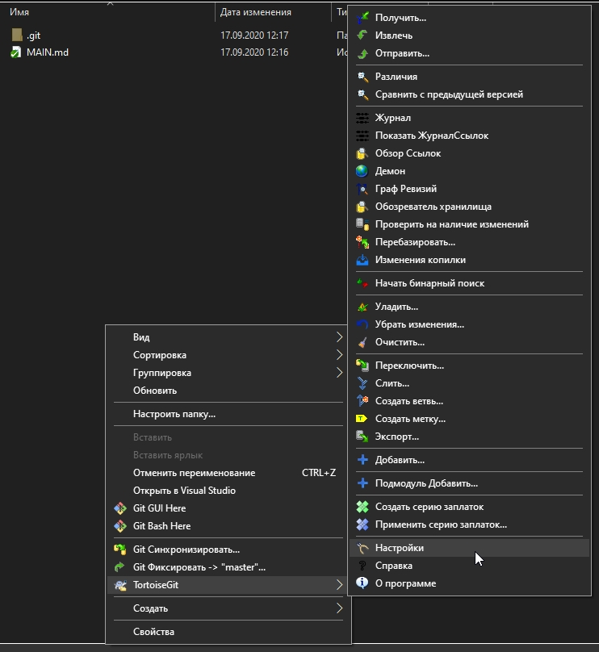

В настройках переходите на вкладку Git, там указываете ваш логин и почту с github.com.
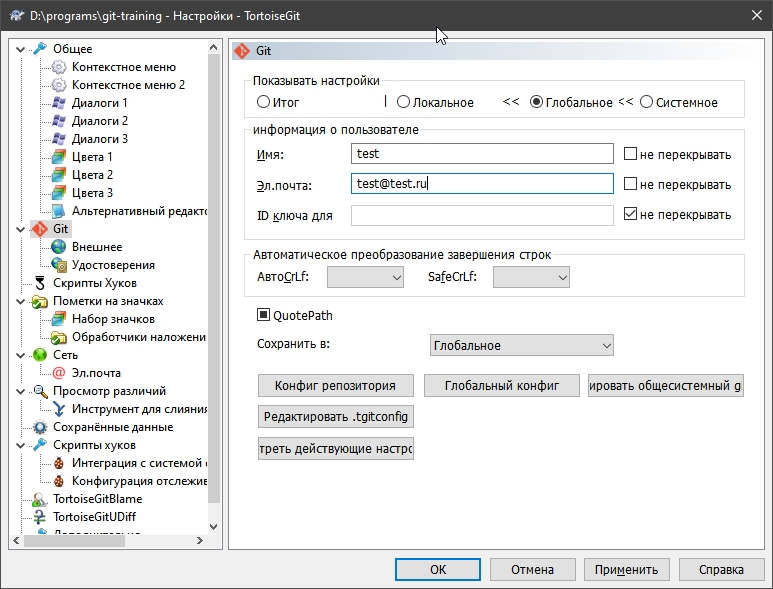

<b>Запомни! Github.com - онлайн-хранилище файлов, git - инструмент для управления версиями файлов, его можно исползовать без доступа в сеть</b>

## Первый репозиторий
<b>Репозиторий - это условная папка на серверах github.com, куда вы загружаете данные. По-умолчанию, любой пользователь может найти ваш репозиторий по его названию, но можно также деать репозиторий приватным. Для обучения лучше использовать публичные. </b>

Создадим ваш первый репозитоий и добавим туда что-нибудь.
1) Открываем в браузере https://github.com/ и входим в свой аккаунт.
2) В левом верхнем углу нажимаем на зелёную кнопочку "new": 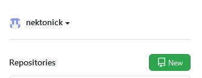
3) Вводим какое-нибудь осмысленое название для репозитория. (Например, "robot-algorithmist", когда вы заливаете того самого робота с пар по основам алгоритмов :3 ). Можете добавить описание к проекту, но это не обязательно. Остальное лучше не трогать. 
        
    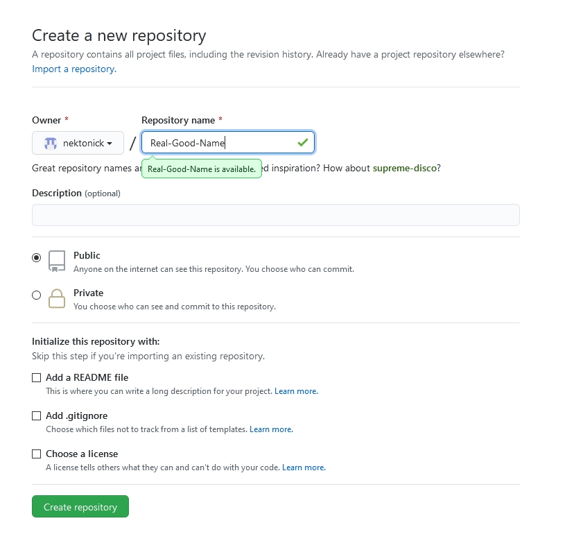
4) Нажимайте на зелёную "create repository" снизу
5) Скопируйте в в открывшейся вкладке текст из адресной строки (Оно будет в формате, `https://github.com/ваш логин на гитхабе/название репозитория`)
6) Открываете в файловом проводнике папку, где хотите хранить ваш проект, кликаете правой кнопкой по пустому месту, выбираете "Git клонировать", там в поле URL вставляете скопированный адрес вашего репозитория: 

    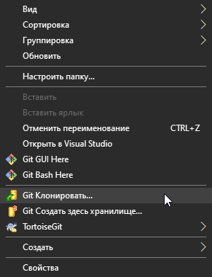 
    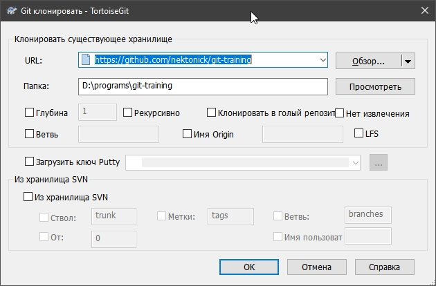
7) Если всё прошло успешно, то будет так: 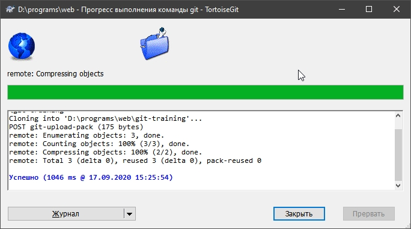
8) Теперь вы можете создавать, изменять и удалять файлы в этой папке, временами сохраняя их и отправляя на сервер. (Если у вас уже есть файлы "робота", просто перетащите их в эту папку). Как это делать смотри в разделе "Коммиты".

## Коммиты
Если вы всё сделали так, как было написано в прошлом разделе, то после изменений внутри папки вы нажимаете на пустое место правой кнопкой мыши, и выбираете "Git Фиксировать -> "master"...": 

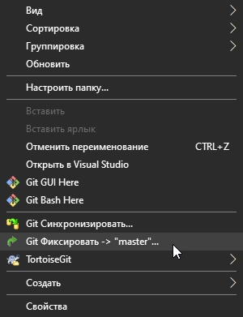

В открывшемся окне сверху пишем описание изменений (это обязательно), в нижнем окне нажимаем на кнопку "Все" (Либо вручную отмечаем галочками файлы, которые хотим "сохранить") 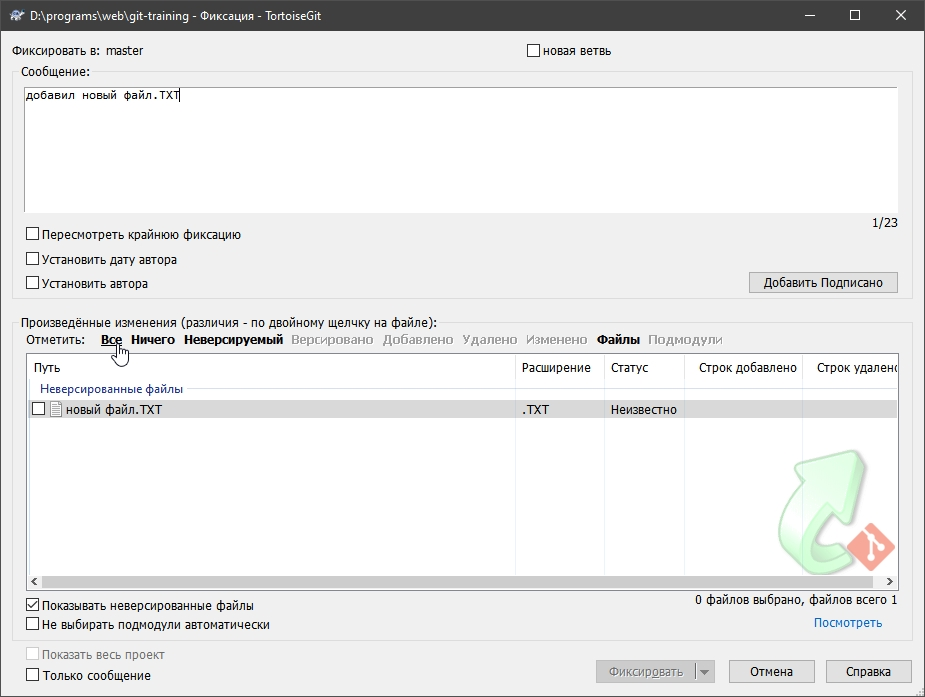

Теперь стала доступна кнопка "Фиксировать". Нажимаем. 
Если всё в порядке, в новом окне нажимаем "Отправить", затем "Ок":  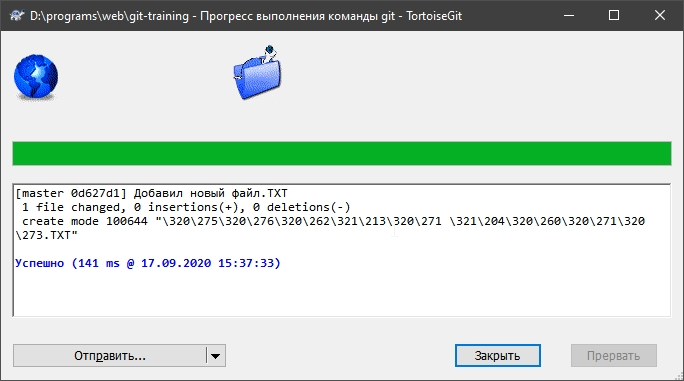 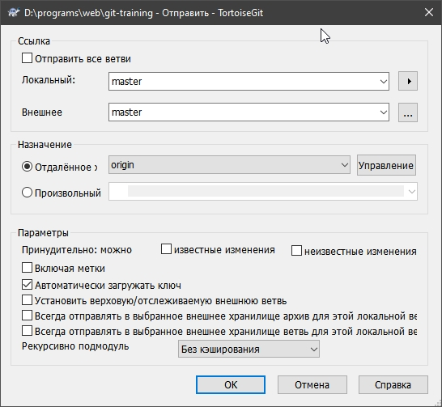

Теперь можно обноваить страницу репозитория на github и полюбоваться на внесённые изменения.

---
## Другое
Это были лишь основы использования git и github, но уже это поможет вам делиться своими проектами с преподавателями и одногруппниками. Дальше вы можете самостоятельно научиться использовать github для работы в команде и для того, чтобы вернуться к старой, исправной версии программы, если допустили ошибку.

---
<b> По всем вопросам обращаться на nik190552@gmail.com
Вы можете делиться этим проектом, сохраняя ссылку на автора: https://github.com/nektonick</b>